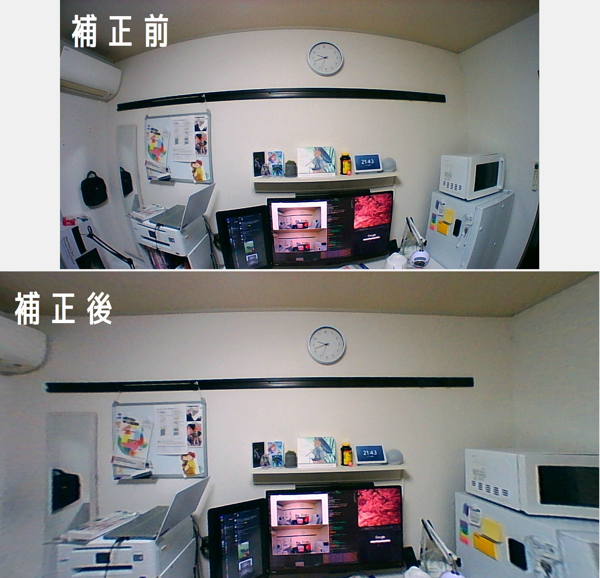

# 魚眼効果補正

[サンワサプライ会議用ワイドレンズWEBカメラ](https://www.amazon.co.jp/dp/B084JRFCW1?ref=ppx_yo2ov_dt_b_product_details&th=1)で撮影した映像の魚眼効果をリアルタイムで補正するソフトウェアです。仮想カメラ(OBS Virtual Camera)としての出力機能を有しています。

補正例

仮想カメラ起動にはOBS Studioが必要となります。